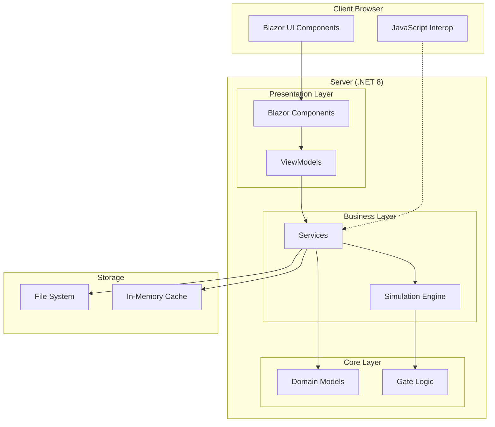
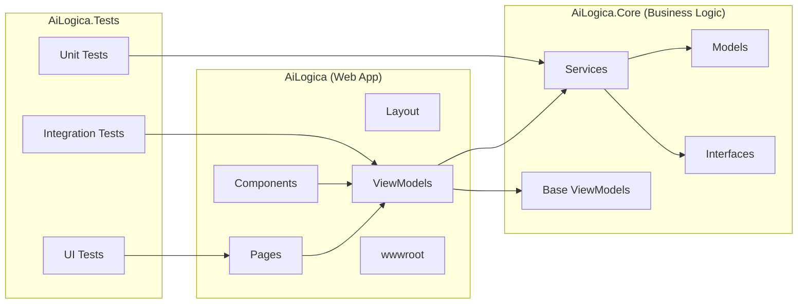
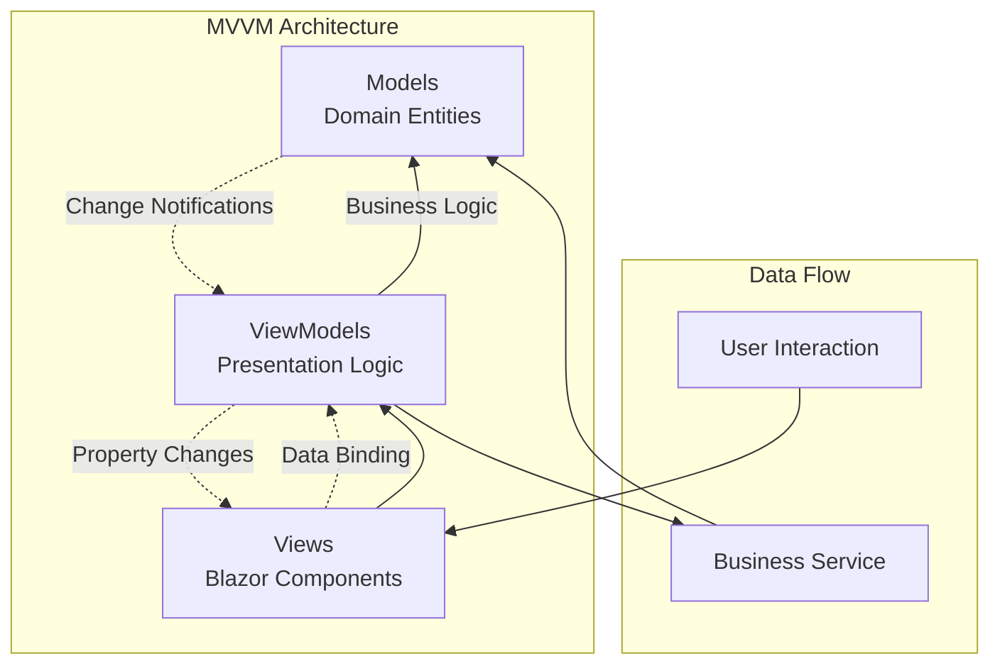
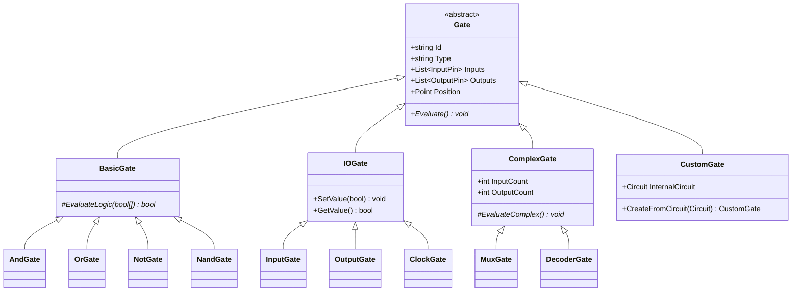
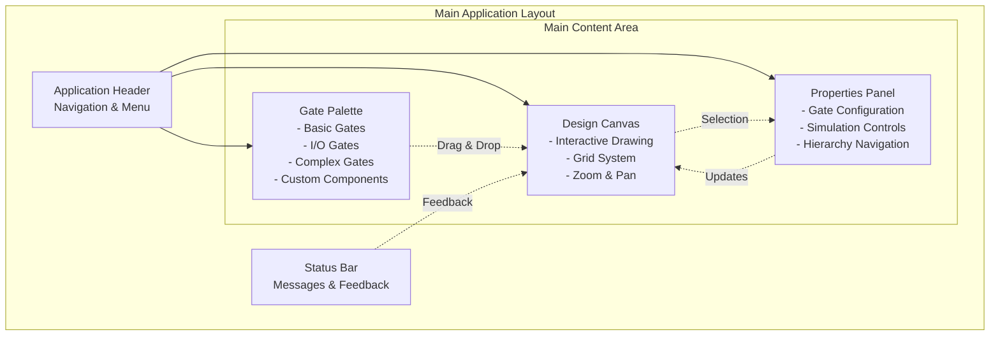
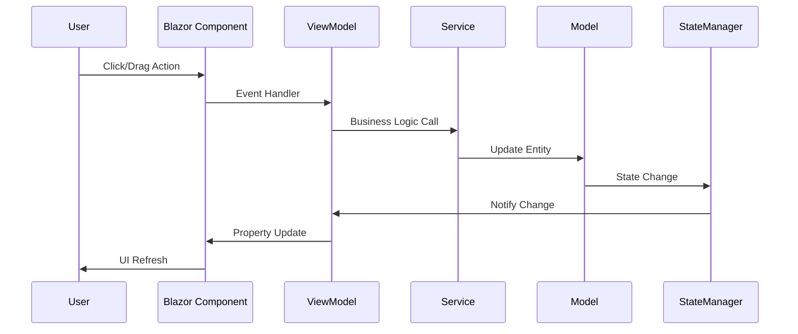
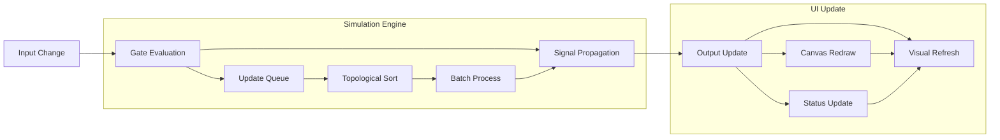
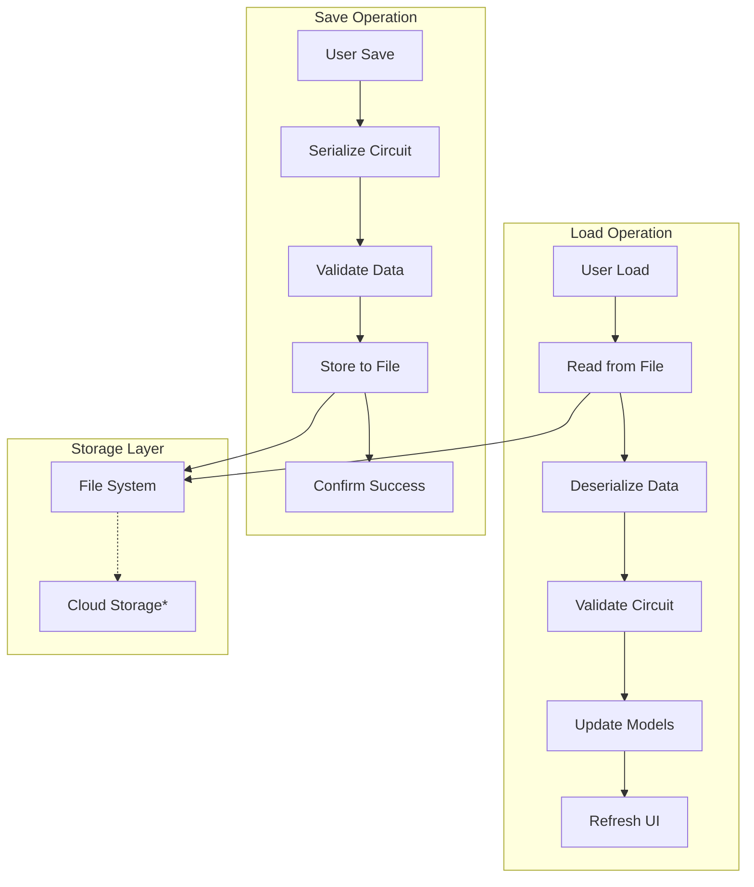

# AI Logica - Technical Architecture

## 1. System Overview

AI Logica is built as a Blazor Server application using .NET 8, providing a rich interactive web interface for logic gate simulation. The architecture follows the Model-View-ViewModel (MVVM) pattern with clear separation of concerns.



### 1.1 Technology Stack
- **Frontend**: Blazor Server Components, HTML5 Canvas, CSS3, JavaScript
- **Backend**: .NET 8, ASP.NET Core
- **Testing**: xUnit, Blazor Testing Framework
- **Build**: MSBuild, .NET CLI

### 1.2 Project Structure
```
ai_logica/
├── AiLogica/              # Main Blazor Server application
│   ├── Components/        # Blazor components
│   │   ├── Layout/       # Layout components
│   │   └── Pages/        # Page components
│   ├── ViewModels/       # Presentation layer view models
│   ├── wwwroot/          # Static web assets
│   └── Program.cs        # Application entry point
├── AiLogica.Core/        # Core business logic and models
│   └── ViewModels/       # Base view model classes
├── AiLogica.Tests/       # Unit and integration tests
└── Documentation/        # Project documentation
```



## 2. Architectural Patterns

### 2.1 MVVM Pattern
The application implements the Model-View-ViewModel pattern:
- **Models**: Core business entities (gates, wires, circuits)
- **Views**: Blazor components and pages
- **ViewModels**: Presentation logic and state management



### 2.2 Component-Based Architecture
- **Blazor Components**: Reusable UI elements
- **Composition**: Complex views built from simple components
- **Data Binding**: Two-way binding between components and view models

### 2.3 Separation of Concerns
- **AiLogica.Core**: Business logic, independent of UI framework
- **AiLogica**: Presentation layer, Blazor-specific implementation
- **AiLogica.Tests**: Testing framework, covering all layers

## 3. Core Components

### 3.1 Gate System Architecture

#### 3.1.1 Gate Abstraction
```csharp
// Planned implementation
public abstract class Gate
{
    public string Id { get; }
    public string Type { get; }
    public List<InputPin> Inputs { get; }
    public List<OutputPin> Outputs { get; }
    public Point Position { get; set; }
    
    public abstract void Evaluate();
}
```



#### 3.1.2 Gate Types
- **BasicGate**: AND, OR, NOT, NAND, NOR, XOR, XNOR
- **IOGate**: INPUT, OUTPUT, CLOCK, CONST
- **ComplexGate**: MUX, DEMUX, DECODER, ENCODER
- **CustomGate**: User-defined composite gates

### 3.2 Circuit Simulation Engine

#### 3.2.1 Simulation Architecture
```csharp
// Planned implementation
public class SimulationEngine
{
    public Circuit Circuit { get; }
    public SimulationState State { get; }
    
    public void Run();
    public void Step();
    public void Pause();
    public void Reset();
}
```

#### 3.2.2 Signal Propagation
- **Event-driven**: Updates propagate only when needed
- **Topological sorting**: Ensures correct evaluation order
- **Cycle detection**: Prevents infinite loops in feedback circuits

### 3.3 Hierarchy Management

#### 3.3.1 Component Abstraction
```csharp
// Planned implementation
public class Component
{
    public string Name { get; }
    public Circuit InternalCircuit { get; }
    public List<InputPin> ExternalInputs { get; }
    public List<OutputPin> ExternalOutputs { get; }
    
    public void CreateBlackBox();
    public void ExpandView();
}
```

#### 3.3.2 Navigation System
- **Breadcrumb navigation**: Track hierarchy levels
- **Drill-down/drill-up**: Seamless level transitions
- **Context preservation**: Maintain state across levels

## 4. User Interface Architecture

### 4.1 Layout Structure
```
┌─────────────────────────────────────────────────────────┐
│                  Application Header                    │
├───────────────┬─────────────────────┬───────────────────┤
│               │                     │                   │
│  Gate Palette │    Design Canvas    │ Properties Panel  │
│               │                     │                   │
│  - Basic      │  ┌─────────────┐   │ - Navigation      │
│  - I/O        │  │   Circuit   │   │ - Properties      │
│  - Complex    │  │   Design    │   │ - Simulation      │
│  - Custom     │  │   Area      │   │ - Hierarchy       │
│               │  └─────────────┘   │                   │
├───────────────┴─────────────────────┴───────────────────┤
│                   Status Bar                            │
└─────────────────────────────────────────────────────────┘
```



### 4.2 Component Hierarchy
- **MainLayout**: Root layout component
- **GatePalette**: Gate selection and categories
- **DesignCanvas**: Interactive drawing area
- **PropertiesPanel**: Configuration and controls
- **StatusBar**: Application status and metrics

### 4.3 State Management
- **ViewModels**: Component-specific state
- **Services**: Shared state and business logic
- **Dependency Injection**: Service registration and resolution

## 5. Data Flow

### 5.1 User Interaction Flow
```
User Action → Component Event → ViewModel → Service → Model → Update → View
```



### 5.2 Simulation Data Flow
```
Input Change → Gate Evaluation → Signal Propagation → Output Update → Visual Refresh
```



### 5.3 Persistence Flow
```
User Save → Serialization → Storage → File System / Database
User Load → File System / Database → Deserialization → Model Update → View Refresh
```



## 6. Performance Considerations

### 6.1 Rendering Optimization
- **Canvas-based drawing**: Efficient for large circuits
- **Dirty region tracking**: Update only changed areas
- **Level-of-detail**: Simplify rendering at high zoom levels

### 6.2 Simulation Performance
- **Incremental updates**: Only evaluate changed gates
- **Parallel evaluation**: Utilize multiple cores where possible
- **Caching**: Store evaluation results for unchanged gates

### 6.3 Memory Management
- **Object pooling**: Reuse gate and wire objects
- **Weak references**: Prevent memory leaks in event handling
- **Dispose patterns**: Proper cleanup of resources

## 7. Testing Strategy

### 7.1 Unit Testing
- **ViewModels**: Property changes, command execution
- **Services**: Business logic validation
- **Models**: Gate evaluation, circuit behavior

### 7.2 Integration Testing
- **Component interaction**: Cross-component communication
- **Data persistence**: Save/load operations
- **Simulation accuracy**: End-to-end circuit behavior

### 7.3 UI Testing
- **Blazor testing**: Component rendering and interaction
- **JavaScript interop**: Canvas operations and events
- **Accessibility**: Keyboard navigation and screen readers

## 8. Security Architecture

### 8.1 Input Validation
- **Client-side**: Immediate feedback for user inputs
- **Server-side**: Authoritative validation and sanitization
- **Model validation**: Data annotation attributes

### 8.2 Data Protection
- **Secure storage**: Encrypted user data where applicable
- **HTTPS**: Secure communication channel
- **CSRF protection**: Built-in ASP.NET Core protection

## 9. Deployment Architecture

### 9.1 Development Environment
- **Local development**: IIS Express, file-based storage
- **Hot reload**: Real-time code changes during development
- **Debug tools**: Browser developer tools, Visual Studio debugger

### 9.2 Production Environment
- **Web server**: IIS, Nginx, or cloud hosting
- **Database**: SQL Server, PostgreSQL, or cloud database
- **CDN**: Static asset delivery optimization
- **Monitoring**: Application insights and logging

## 10. Extensibility Points

### 10.1 Plugin Architecture
- **Gate plugins**: Custom gate type implementations
- **Export plugins**: Additional file format support
- **Theme plugins**: Custom visual themes

### 10.2 API Design
- **Service interfaces**: Well-defined contracts
- **Event system**: Loosely-coupled component communication
- **Configuration**: Flexible application settings

### 10.3 Future Enhancements
- **Real-time collaboration**: SignalR integration
- **Cloud storage**: Integration with cloud providers
- **Mobile support**: Progressive Web App capabilities
- **AI assistance**: Intelligent circuit suggestions and optimization