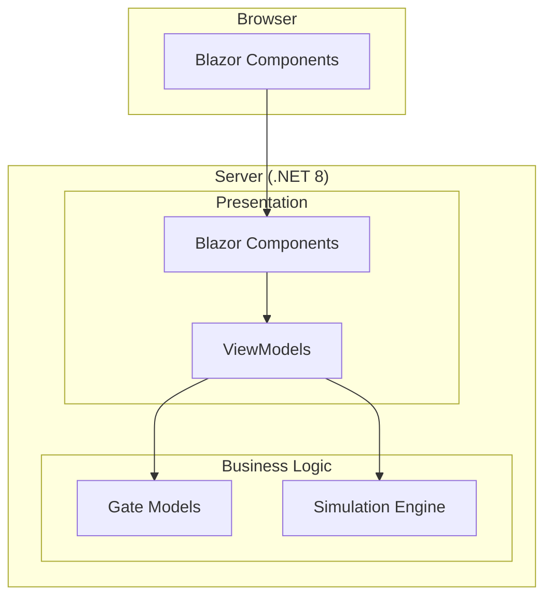

# AI Logica - Technical Architecture

## 1. Current System Overview

AI Logica is currently implemented as a Blazor Server application using .NET 8. The project follows a standard Blazor Server template structure with plans for logic gate simulation functionality.

### 1.1 Technology Stack
- **Frontend**: Blazor Server Components, HTML5, CSS3
- **Backend**: .NET 8, ASP.NET Core
- **Testing**: xUnit
- **Build**: MSBuild, .NET CLI

### 1.2 Current Project Structure
```
ai_logica/
├── AiLogica/              # Main Blazor Server application
│   ├── Components/        # Blazor components
│   │   ├── Layout/       # Standard layout components
│   │   └── Pages/        # Standard template pages (Home, Counter, Weather)
│   ├── ViewModels/       # (Future) Presentation layer view models
│   ├── wwwroot/          # Static web assets
│   └── Program.cs        # Application entry point
├── AiLogica.Core/        # Core business logic library
│   └── ViewModels/       # Base ViewModel implementation
├── AiLogica.Tests/       # Test project
└── [Documentation]/     # Project documentation files
```

## 2. Current Implementation State

### 2.1 Implemented Components
- **ViewModelBase**: Basic MVVM foundation with INotifyPropertyChanged implementation
- **Standard Blazor Pages**: Template pages (Home, Counter, Weather, Error)
- **Layout System**: Standard Blazor Server layout structure
- **Basic Project Structure**: Multi-project solution setup

### 2.2 Planned Architecture

When logic gate simulation features are implemented, the architecture will expand to include:



### 2.3 Development Principles
- Clean separation of concerns between presentation and business logic
- MVVM pattern for maintainable UI code
- Test-driven development approach
- Extensible architecture for future feature additions
