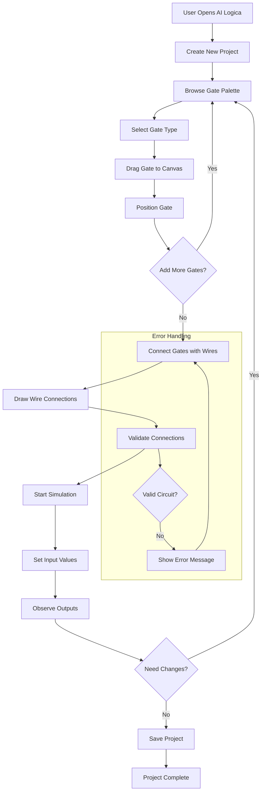
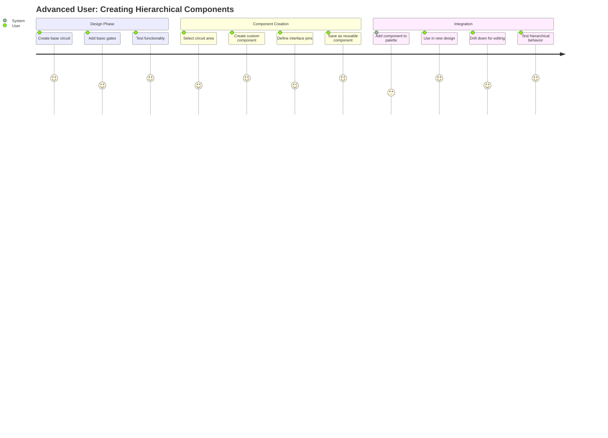

# AI Logica - Requirements Specification

## 1. Functional Requirements

### 1.1 Gate Management
- **FR-1.1**: Users shall be able to select logic gates from a categorized palette
  - Basic gates: AND, OR, NOT, NAND, NOR, XOR, XNOR, BUFFER
  - Input/Output: INPUT, OUTPUT, CLOCK, CONST
  - Complex gates: MUX, DEMUX, DECODER, ENCODER
  - Custom gates: User-defined reusable components
- **FR-1.2**: Users shall be able to drag gates from the palette onto the design canvas
- **FR-1.3**: Users shall be able to position gates freely on the design canvas
- **FR-1.4**: Users shall be able to delete gates from the design canvas
- **FR-1.5**: Users shall be able to configure gate properties (number of inputs, initial values)

### 1.2 Wiring and Connections
- **FR-2.1**: Users shall be able to connect gate outputs to gate inputs
- **FR-2.2**: Users shall be able to create wire segments with visual feedback
- **FR-2.3**: Users shall be able to delete wire connections
- **FR-2.4**: The system shall prevent invalid connections (output-to-output, multiple outputs to single input)
- **FR-2.5**: The system shall display connection points clearly on all gates

### 1.3 Circuit Simulation
- **FR-3.1**: The system shall simulate the logical behavior of connected gates
- **FR-3.2**: Users shall be able to run continuous simulation mode
- **FR-3.3**: Users shall be able to step through simulation updates incrementally
- **FR-3.4**: Users shall be able to pause and resume simulation
- **FR-3.5**: The system shall visually indicate signal states on wires and gates
- **FR-3.6**: Users shall be able to set input values and observe outputs

### 1.4 Component Hierarchy and Abstraction
- **FR-4.1**: Users shall be able to save circuit layouts as reusable components
- **FR-4.2**: Users shall be able to use saved components as black boxes in other layouts
- **FR-4.3**: Users shall be able to drill down into black box components to view internal structure
- **FR-4.4**: Users shall be able to drill up from a component to see its usage context
- **FR-4.5**: The system shall maintain a hierarchical view of the entire design
- **FR-4.6**: Users shall be able to navigate between hierarchy levels using breadcrumb navigation

### 1.5 Design Management
- **FR-5.1**: Users shall be able to create new design projects
- **FR-5.2**: Users shall be able to save design projects to persistent storage
- **FR-5.3**: Users shall be able to load previously saved design projects
- **FR-5.4**: Users shall be able to export designs in standard formats
- **FR-5.5**: The system shall maintain design version history

### 1.6 User Interface
- **FR-6.1**: The system shall provide a three-panel layout (palette, canvas, properties)
- **FR-6.2**: Users shall be able to zoom in and out of the design canvas
- **FR-6.3**: Users shall be able to pan across large designs
- **FR-6.4**: The system shall provide grid alignment for precise gate placement
- **FR-6.5**: Users shall be able to select multiple gates for bulk operations
- **FR-6.6**: The system shall provide undo/redo functionality

## 2. Non-Functional Requirements

### 2.1 Performance
- **NFR-1.1**: The system shall respond to user interactions within 100ms
- **NFR-1.2**: Simulation updates shall complete within 50ms for circuits up to 1000 gates
- **NFR-1.3**: The application shall support circuits with up to 10,000 gates
- **NFR-1.4**: File operations (save/load) shall complete within 2 seconds for typical designs

### 2.2 Usability
- **NFR-2.1**: New users shall be able to create a basic circuit within 5 minutes
- **NFR-2.2**: The interface shall be accessible via keyboard navigation
- **NFR-2.3**: The system shall provide contextual help and tooltips
- **NFR-2.4**: Error messages shall be clear and actionable
- **NFR-2.5**: The application shall work on desktop browsers (Chrome, Firefox, Safari, Edge)

### 2.3 Reliability
- **NFR-3.1**: The system shall have 99.9% uptime
- **NFR-3.2**: The application shall gracefully handle invalid user inputs
- **NFR-3.3**: Data loss shall not occur during normal operation
- **NFR-3.4**: The system shall recover from simulation errors without crashing

### 2.4 Maintainability
- **NFR-4.1**: Code coverage shall be maintained at 80% or higher
- **NFR-4.2**: All public APIs shall be documented
- **NFR-4.3**: The codebase shall follow established coding standards
- **NFR-4.4**: New features shall not break existing functionality

### 2.5 Security
- **NFR-5.1**: User data shall be stored securely
- **NFR-5.2**: The application shall validate all user inputs
- **NFR-5.3**: No sensitive information shall be exposed in error messages

### 2.6 Scalability
- **NFR-6.1**: The architecture shall support multiple concurrent users
- **NFR-6.2**: The system shall be deployable in containerized environments
- **NFR-6.3**: Component libraries shall support unlimited custom components

## 3. User Journeys and Workflow

### 3.1 Basic Circuit Design Workflow

### 3.2 Advanced User Journey - Hierarchical Design

## 4. Conflicting Requirements and Trade-offs

### 3.1 Performance vs. Feature Richness
**Conflict**: Real-time simulation performance vs. support for complex gate types
- **Trade-off**: Implement performance tiers - simple gates for real-time, complex gates for step-by-step simulation
- **Decision Required**: Priority between responsiveness and simulation accuracy

### 3.2 Usability vs. Power User Features
**Conflict**: Simple interface for beginners vs. advanced features for experts
- **Trade-off**: Progressive disclosure - basic interface with advanced features hidden behind menus
- **Decision Required**: Default interface complexity level

### 3.3 Educational Focus vs. Professional Features
**Conflict**: Educational simplicity vs. industry-standard capabilities
- **Trade-off**: Multiple interface modes - "Learning" and "Professional"
- **Decision Required**: Primary target audience priority

### 3.4 Browser Compatibility vs. Modern Features
**Conflict**: Wide browser support vs. modern web APIs for performance
- **Trade-off**: Feature detection with graceful degradation
- **Decision Required**: Minimum supported browser versions

### 3.5 Real-time Collaboration vs. Performance
**Conflict**: Multi-user editing capabilities vs. simulation performance
- **Trade-off**: Implement collaboration as optional feature with performance impact warnings
- **Decision Required**: Single-user vs. multi-user priority

### 3.6 File Format Compatibility vs. Feature Support
**Conflict**: Standard format export vs. proprietary features
- **Trade-off**: Multiple export formats with feature subset warnings
- **Decision Required**: Priority between interoperability and unique features

## 4. Assumptions and Dependencies

### 4.1 Technical Assumptions
- Modern web browsers support HTML5 Canvas and JavaScript ES6+
- Users have reliable internet connectivity for web application access
- Client devices have sufficient memory for large circuit simulations

### 4.2 Business Assumptions
- Educational institutions will adopt web-based simulation tools
- Users prefer browser-based tools over desktop applications
- Open-source development model will attract contributors

### 4.3 External Dependencies
- .NET 8 runtime and hosting environment
- Modern web browser with JavaScript enabled
- SignalR for real-time communication (if collaborative features implemented)